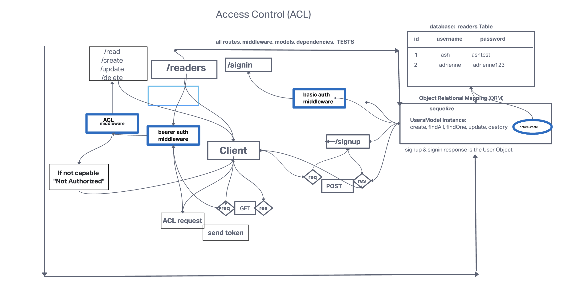

## Problem Domain

Create an API Auth server:

  API Auth server must be deployed. A single, backend application is expected
  Use of your API server to perform database operations
  Use of login/auth/acl to control access to your resources

#### Our project

# books-api

## Authors 

Ashwini Uppal & Adrienne Frey

## Project

Book API

This is a simple API server that allows users to create, read, update, and delete books and coffee. You can also sign up and sign in as a user. The API server is built using Express.js and uses postgreSQL as the database. 

We have also implemented an access control list (ACL). 

We have also implemented one to many relationships between the books and users which will basically show the books read by a user.

## How to initialize application
nodemon or npm start

## Features/Routes

There are two models in this application : books and coffee. 
The books model has the following properties:
- name
- category
- author

The coffee model has the following properties:
- name
- type
- price

The following routes are available for the books model:
- GET /books
- GET /books/:id
- POST /books
- PUT /books/:id
- DELETE /books/:id

The following routes are available for the coffee model:
- GET /coffee
- GET /coffee/:id
- POST /coffee
- PUT /coffee/:id
- DELETE /coffee/:id

## TESTING:

Tested the app for the following scenarios:
-allows existing user to signin
-allows new user to signup
-allows access depending on the role of the user
-allows access to the correct routes
-allows access to the correct routes depending on the role of the user
-allows authenticated users to create a new book
-allows authenticated users to update a book
-allows authenticated users to delete a book

tests are located in the __tests__ folder.
[tests](https://github.com/ashuppal/book-api/tree/main/__tests__)

## UML:

## Collaborators:

Adrienne Frey
Ash Uppal
