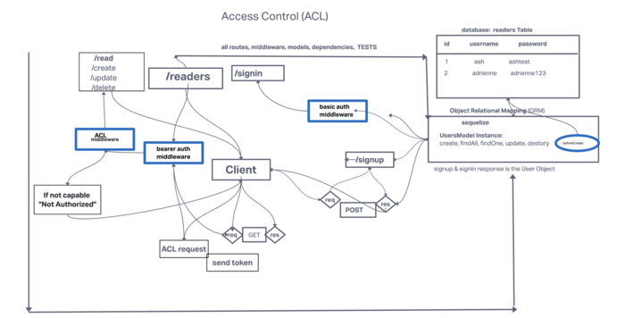

# books-api

## Project
Book API

## Authors 
Ashwini Uppal & Adrienne Frey

## Problem Domain
Create an API Auth server:

  API Auth server must be deployed. A single, backend application is expected
  Use of your API server to perform database operations
  Use of login/auth/acl to control access to your resources

## How to initialize application
nodemon or npm start

## Features/Routes

Access Control (ACL)
This is a simple access control list (ACL) for Node.js. It is designed to be used with Express.js, but can be used with any other framework or without a framework at all.

## TESTING:

Tested the app for the following scenarios:
-allows existing user to signin
-allows new user to signup
-allows access depending on the role of the user

tests are located in the __tests__ folder.
[tests](https://github.com/ashuppal/book-api/tree/main/__tests__)

## UML:

## Collaborators:

Adrienne Frey
Ash Uppal
